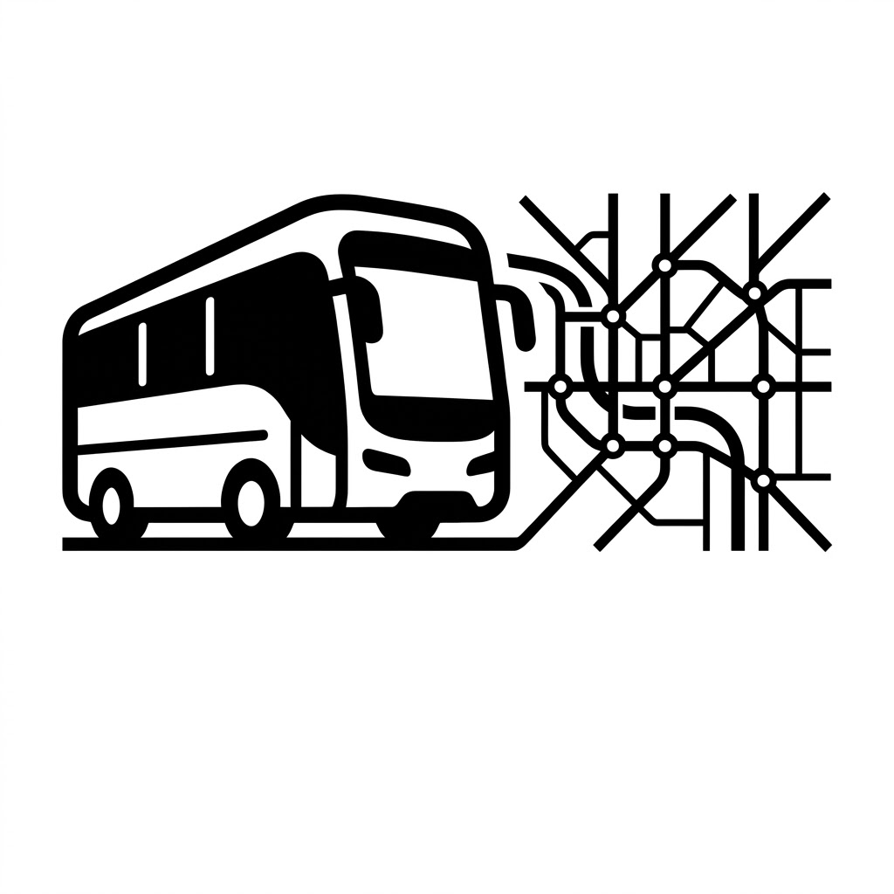

<div align="center">



# BUSearch frontend v2

**Komunikacja miejska na żywo: śledzenie pojazdów, tablice przystankowe, rozkłady jazdy i planer podróży.**

[](https://github.com/szymon82723/BUSearch-frontend-v2/releases)
[](https://github.com/szymon82723/BUSearch-frontend-v2)
[](LICENSE)


[**Wypróbuj wersję beta na żywo**](https://beta-testy.busearch.pl)

</div>

## O aplikacji

**BUSearch frontend v2** to nowa odsłona interfejsu webowego systemu BUSearch, przepisana od podstaw z wykorzystaniem React 19, TypeScriptu, Vite oraz MapLibre GL. Zastępuje dotychczasowy frontend v1, wprowadzając responsywny interfejs inspirowany Material 3 (panele dolne Bottom Sheet z obsługą gestów przeciągania na telefonach), zoptymalizowane renderowanie mapy wektorowej, zaawansowaną wyszukiwarkę oraz zintegrowany planer podróży.

Projekt tworzy **Szymon Czaja** ([szymo.xyz](https://szymo.xyz)). Kod powstaje w modelu wspomaganym przez asystentów AI; Szymon odpowiada za koncepcję, architekturę, dobór funkcji oraz audyt działania na rzeczywistych danych transportowych.

## Funkcje

- **Śledzenie pojazdów na żywo:** pozycje autobusów i tramwajów w czasie rzeczywistym na mapie wektorowej, estymowane opóźnienia (ETA), stan odświeżenia danych oraz numer taborowy prezentowany pod znacznikiem pojazdu.
- **Przebieg trasy i śledzenie kursu:** panel pojazdu z listą kolejnych przystanków, godzinami rozkładowymi i prognozowanymi oraz automatycznym prowadzeniem kamery mapy za pojazdem.
- **Tablice odjazdów z przystanków:** rzeczywiste i rozkładowe godziny odjazdów, oznaczenia słupków, kierunki, wyróżnienia linii tramwajowych i autobusowych oraz obsługa przystanków współdzielonych.
- **Wyszukiwarka połączeń:** planer podróży door-to-door z wyborem słupków, czasem wyjazdu w strefie czasowej Polski, limitem przesiadek, preferowanym tempem marszu i prezentacją trasy na mapie.
- **Rozkłady jazdy:** pełne tablice rozkładów dla linii i słupków, z podziałem na kierunki, typy dni, legendę i wybór konkretnej daty z kalendarza.
- **Wyszukiwarka przystanków i linii:** szybkie wyszukiwanie z tolerancją na brak polskich znaków diakrytycznych, obsługą klawiatury (strzałki, Enter, Escape, Tab), IME i prezentacją kodów słupków.
- **Filtry floty:** filtrowanie pojazdów wg typu (autobus, tramwaj, trolejbus, pociąg), modelu, napędu elektrycznego, obecności zdjęć w bazie czy numerów taborowych.
- **Powiadomienia o odjazdach:** możliwość subskrypcji odjazdów z wybranego słupka (Web Push / mostek mobilny Android).
- **Obsługa wielu miast:** dedykowane konfiguracje dla Bydgoszczy, Torunia i Trójmiasta (linie tramwajowe, granice mapy, specyficzne integracje ITS).
- **Nowoczesny interfejs:** ciemny motyw z czytelnym kontrastem, panele dolne (bottom sheets) z płynnymi animacjami na urządzeniach mobilnych oraz ergonomiczny układ desktopowy.

## Uruchomienie lokalne

Do uruchomienia projektu wymagany jest [Bun](https://bun.sh) (zalecany) lub Node.js 20+.

```sh
# Instalacja zależności
bun install

# Uruchomienie serwera deweloperskiego (port 1500, proxy do API na porcie 47821)
bun run dev

# Kompilacja TypeScriptu i budowanie produkcyjne
bun run build

# Podgląd wersji produkcyjnej
bun run preview
```

## Filmy demonstracyjne

Strony prezentacyjne korzystają ze zoptymalizowanych plików `public/videos/*-web.mp4` (H.264 Main, YUV 4:2:0, 720 px szerokości, 30 fps, bez dźwięku, `faststart`). W repozytorium zachowano gotowe wersje webowe (`app-demo-web.mp4` i `ios-install-web.mp4`).

## Testy

Projekt posiada zestaw testów automatycznych uruchamianych w Chromium:

```sh
bun run test:map              # Testy mapy, paneli i akcji
bun run test:vehicle          # Test panelu i śledzenia pojazdu
bun run test:vehicle:overlap  # Test markerów nakładających się pojazdów
bun run test:line             # Test wyboru linii i wariantów tras
bun run test:timetable        # Test tablicy rozkładu i kursów
bun run test:search           # Test wyszukiwarki linii i słupków
bun run test:planner          # Test planera połączeń (desktop i mobile)
bun run test:planner:mobile   # Pełny audyt mobilny planera (30 przebiegów)
```

## Zgodność z wersją produkcyjną (v1)

Bieżący stan implementacji, testów i zgodności funkcji z dotychczasowym frontendem produkcyjnym opisuje [dziennik zgodności](docs/frontend-parity.md).

## Licencja

Copyright (C) 2026 **Szymon Czaja**.

Projekt jest wolnym oprogramowaniem udostępnianym na licencji [GNU General Public License v3.0 (GPLv3)](LICENSE).
